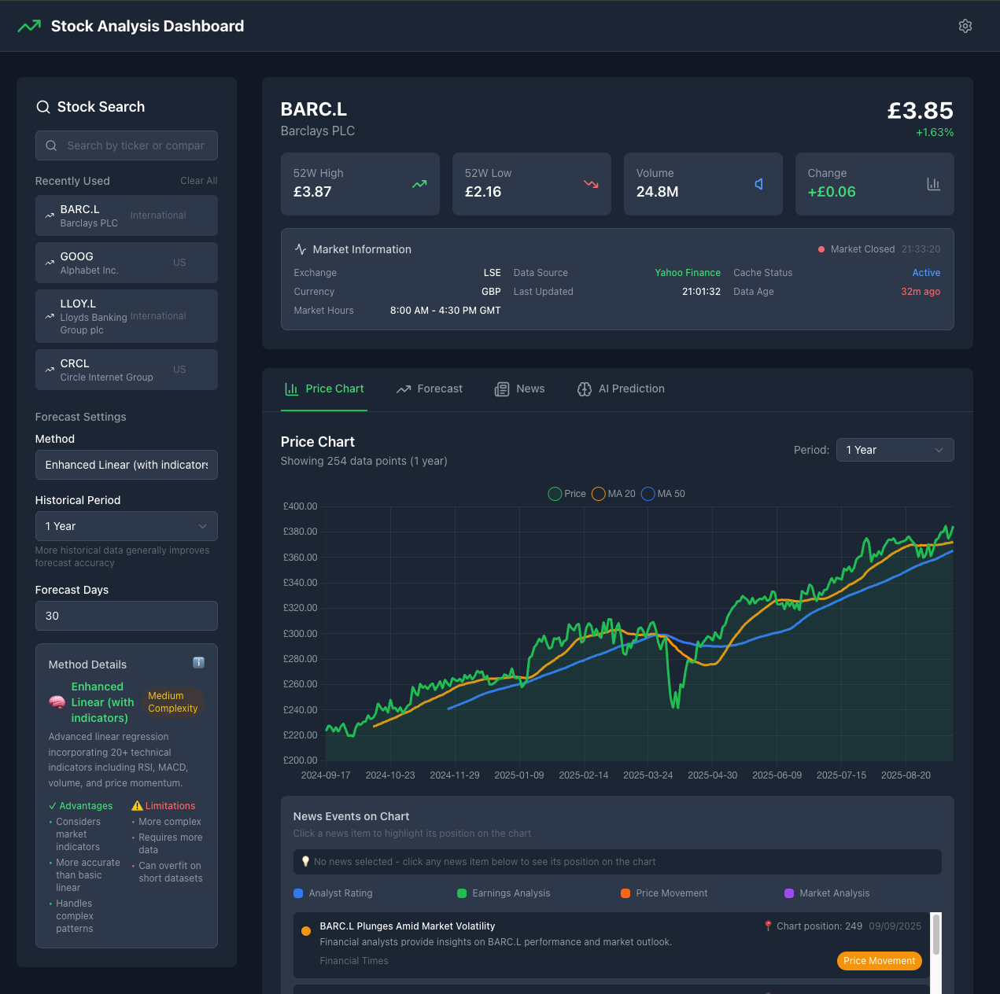

# 📈 Stock Analysis Platform

[](https://opensource.org/licenses/MIT)
[](https://reactjs.org/)
[](https://reactnative.dev/)
[](https://fastapi.tiangolo.com/)
[](https://www.typescriptlang.org/)
[](https://python.org/)
[](https://tailwindcss.com/)

A unified, full-stack stock analysis platform with **web**, **mobile**, and **backend** components. Built with modern technologies and designed for scalability, maintainability, and cross-platform consistency.

## 📸 Screenshot



*The Stock Analysis Platform web interface showing real-time stock data, interactive charts, forecasting, and AI-powered predictions.*

## 🏗️ Architecture

```
📁 StockAnalysisPlatform/
├── 🔧  backend/                # FastAPI Python backend
├── 🌐  web/                   # React web application
├── 📱  mobile/                # React Native mobile app
├── 📚  shared/                # Shared code and types
│   ├── types/                 # TypeScript type definitions
│   └── utils/                 # Shared utility functions
├── 🐳  docker/                # Docker configuration
└── 📜  scripts/               # Build and deployment scripts
```

## 🚀 Features

### Core Functionality
- **📈 Real-time Stock Data**: Live prices, charts, and market information
- **🔍 Advanced Search**: Search stocks by ticker symbol or company name
- **📊 Interactive Charts**: Candlestick charts with technical indicators
- **🔮 Multiple Forecasting**: 8+ forecasting algorithms
- **🤖 AI Predictions**: LLM-powered stock predictions and backtesting
- **📰 Real-time News**: Latest market news with sentiment analysis
- **🌍 International Support**: US, UK, EU, JP, and other global markets

### Platform-Specific Features

#### 🌐 Web Application
- **Modern React UI**: Built with TypeScript and Tailwind CSS
- **Responsive Design**: Works on desktop, tablet, and mobile
- **Dark Theme**: Beautiful dark mode interface
- **Interactive Charts**: Chart.js with annotations and news events
- **Real-time Updates**: Live data refresh and notifications

#### 📱 Mobile Application
- **React Native**: Cross-platform iOS and Android support
- **Native Performance**: Optimized for mobile devices
- **Offline Support**: Cached data for offline viewing
- **Push Notifications**: Real-time alerts and updates
- **Gesture Support**: Swipe and touch interactions

#### 🔧 Backend API
- **FastAPI**: High-performance Python API
- **Comprehensive Endpoints**: Stock data, forecasting, news, AI predictions
- **Caching**: DuckDB for efficient data storage
- **Rate Limiting**: API protection and optimization
- **Documentation**: Auto-generated OpenAPI/Swagger docs

## 🛠️ Technology Stack

### Backend
- **Python 3.8+** with FastAPI
- **yfinance** for stock data
- **scikit-learn** for machine learning
- **Prophet** for time series forecasting
- **DuckDB** for caching
- **Transformers** for AI predictions

### Web Frontend
- **React 18** with TypeScript
- **Tailwind CSS** for styling
- **Chart.js** for visualizations
- **Axios** for API communication
- **React Router** for navigation

### Mobile Frontend
- **React Native** with TypeScript
- **Expo** for development and deployment
- **React Navigation** for navigation
- **React Native Paper** for UI components
- **React Native Chart Kit** for charts

### Shared
- **TypeScript** for type safety
- **Shared Types** across all platforms
- **Utility Functions** for formatting and calculations
- **Consistent API** contracts

## 🚀 Quick Start

### Prerequisites
- **Node.js** 18+ and npm
- **Python** 3.8+
- **Git**

### Installation

1. **Clone the repository**
   ```bash
   git clone https://github.com/your-username/stock-analysis-platform.git
   cd stock-analysis-platform
   ```

2. **Install all dependencies**
   ```bash
   npm run install:all
   ```

3. **Start all services**
   ```bash
   npm run start:all
   ```

### Individual Service Setup

#### Backend Setup
```bash
cd backend
python -m venv venv
source venv/bin/activate  # On Windows: venv\Scripts\activate
pip install -r requirements.txt
uvicorn main:app --reload
```

#### Web Setup
```bash
cd web
npm install
npm start
```

#### Mobile Setup
```bash
cd mobile
npm install
npm start
```

## 📱 Platform Access

- **Web Application**: http://localhost:3000
- **Mobile Application**: Expo Go app (scan QR code)
- **Backend API**: http://localhost:8000
- **API Documentation**: http://localhost:8000/docs

## 🔧 Development

### Available Scripts

```bash
# Installation
npm run install:all          # Install all dependencies
npm run install:backend      # Install backend dependencies
npm run install:web          # Install web dependencies
npm run install:mobile       # Install mobile dependencies

# Development
npm run start:all            # Start all services
npm run start:backend        # Start backend only
npm run start:web            # Start web only
npm run start:mobile         # Start mobile only

# Building
npm run build:web            # Build web for production
npm run build:mobile         # Build mobile for production

# Testing
npm run test:all             # Run all tests
npm run test:backend         # Run backend tests
npm run test:web             # Run web tests
npm run test:mobile          # Run mobile tests

# Code Quality
npm run lint:all             # Lint all code
npm run type-check:all       # Type check all code

# Docker
npm run docker:build         # Build Docker images
npm run docker:up            # Start with Docker
npm run docker:down          # Stop Docker containers
```

### Project Structure

```
StockAnalysisPlatform/
├── backend/                 # FastAPI backend
│   ├── main.py             # Main application
│   ├── llm_predictor.py    # AI prediction module
│   ├── requirements.txt    # Python dependencies
│   └── test_main.py        # Backend tests
├── web/                    # React web app
│   ├── src/
│   │   ├── components/     # React components
│   │   ├── services/       # API services
│   │   └── types/          # TypeScript types
│   ├── package.json        # Web dependencies
│   └── tailwind.config.js  # Tailwind configuration
├── mobile/                 # React Native app
│   ├── src/
│   │   ├── components/     # React Native components
│   │   ├── screens/        # App screens
│   │   └── services/       # API services
│   ├── package.json        # Mobile dependencies
│   └── app.json            # Expo configuration
├── shared/                 # Shared code
│   ├── types/              # TypeScript types
│   └── utils/              # Utility functions
└── docker/                 # Docker configuration
    ├── docker-compose.yml  # Multi-service setup
    ├── Dockerfile.backend  # Backend container
    └── Dockerfile.web      # Web container
```

## 🧪 Testing

### Backend Testing
```bash
cd backend
source venv/bin/activate
pytest --cov=. --cov-report=html
```

### Web Testing
```bash
cd web
npm test
npm run test:coverage
```

### Mobile Testing
```bash
cd mobile
npm test
```

## 🐳 Docker Deployment

### Development
```bash
docker-compose up --build
```

### Production
```bash
docker-compose -f docker-compose.prod.yml up -d
```

## 📊 API Endpoints

### Stock Data
- `POST /api/stock-data` - Get stock data
- `POST /api/search` - Search stocks
- `GET /api/health` - Health check

### Forecasting
- `POST /api/forecast` - Get stock forecasts
- `POST /api/forecast/methods` - Get available methods

### News
- `POST /api/news` - Get stock news
- `POST /api/news/sentiment` - Analyze news sentiment

### AI Predictions
- `POST /api/llm/predict` - Get AI predictions
- `POST /api/llm/backtest` - Run backtesting

## 🔒 Security

- **CORS** enabled for cross-origin requests
- **Rate limiting** on API endpoints
- **Input validation** with Pydantic
- **Error handling** with proper HTTP status codes
- **API key** support for external services

## 📈 Performance

- **Caching** with DuckDB for fast data access
- **Lazy loading** for large datasets
- **Image optimization** for mobile
- **Code splitting** for web bundle size
- **Memory management** for long-running processes

## 🌍 Internationalization

- **Multi-currency** support
- **Exchange detection** for global markets
- **Timezone handling** for market hours
- **Localized formatting** for numbers and dates

## 🤝 Contributing

1. Fork the repository
2. Create a feature branch
3. Make your changes
4. Add tests
5. Submit a pull request

See [CONTRIBUTING.md](CONTRIBUTING.md) for detailed guidelines.

## 📄 License

This project is licensed under the MIT License - see the [LICENSE](LICENSE) file for details.

## 🙏 Acknowledgments

- **yfinance** for stock data
- **FastAPI** for the backend framework
- **React** and **React Native** for the frontends
- **Chart.js** for data visualization
- **Tailwind CSS** for styling

## 📞 Support

- **Issues**: [GitHub Issues](https://github.com/your-username/stock-analysis-platform/issues)
- **Discussions**: [GitHub Discussions](https://github.com/your-username/stock-analysis-platform/discussions)
- **Documentation**: [Wiki](https://github.com/your-username/stock-analysis-platform/wiki)

---

**Built with ❤️ for the financial analysis community**
